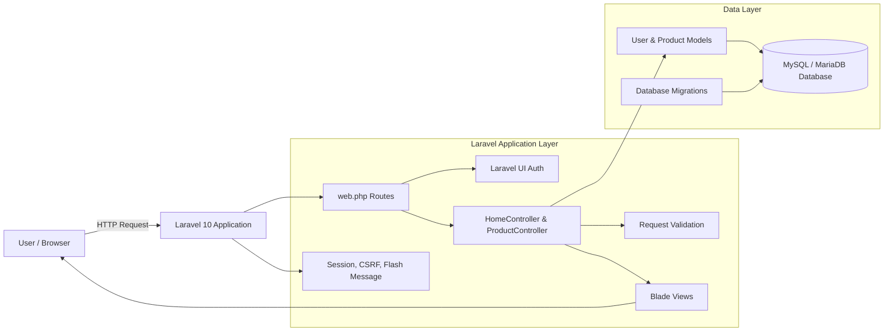
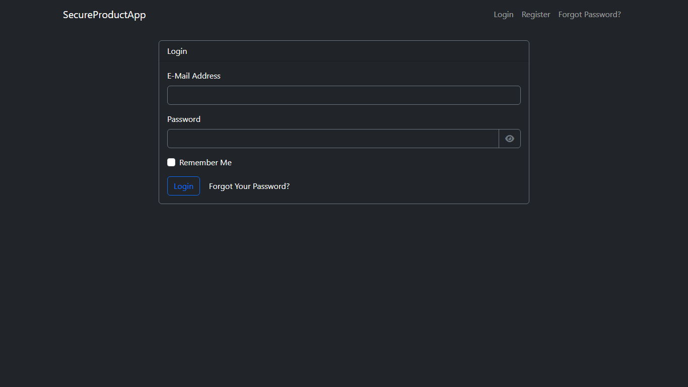
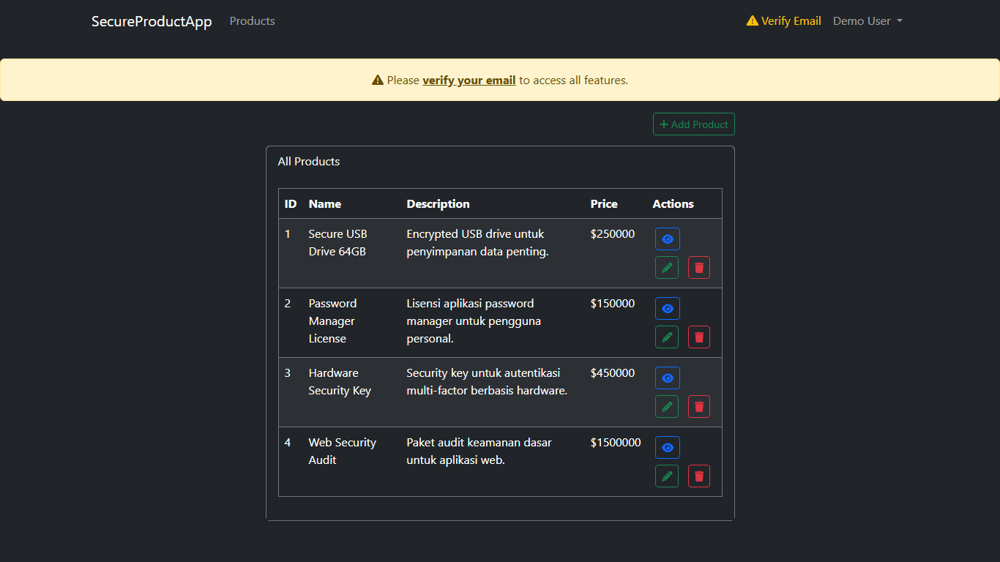

# SecureProductVault

SecureProductVault adalah aplikasi demo **Laravel Product CRUD dengan autentikasi pengguna** untuk kebutuhan pembelajaran keamanan data dan informasi. Project ini menyediakan proses register, login, logout, verifikasi email, serta manajemen data produk yang hanya dapat diakses oleh pengguna yang sudah terautentikasi.

Aplikasi ini mensimulasikan sistem sederhana untuk mengelola data produk. Pengguna dapat membuat akun, masuk ke dashboard, lalu melakukan operasi **Create, Read, Update, dan Delete (CRUD)** pada data produk. Laravel menangani autentikasi, session, CSRF protection, validasi request, routing, migration database, dan rendering halaman melalui Blade template.

> **Rekomendasi nama repository GitHub:** `SecureProductVault-Laravel`  
> Alternatif: `Laravel-Secure-Product-CRUD`, `AuthProductHub-Laravel`, `ProductGuard-CRUD`, atau `KeamananData-Laravel-CRUD-Auth`.

---

## Architecture



Secara alur, browser mengirim request ke Laravel melalui route di `routes/web.php`. Route autentikasi dibuat oleh Laravel UI, sedangkan route produk diarahkan ke `ProductController` dan dibatasi middleware `auth`. Controller memvalidasi input, mengakses model `Product`, menyimpan atau mengambil data dari database, lalu mengembalikan halaman Blade kepada pengguna.

---

## Tech Stack

| Kategori                        | Teknologi                     |
| ------------------------------- | ----------------------------- |
| Backend Framework               | Laravel 10                    |
| Bahasa Backend                  | PHP `^8.1`                    |
| Autentikasi                     | Laravel UI `^4.6`             |
| Frontend View                   | Blade Template                |
| UI Styling                      | Bootstrap 5, Font Awesome     |
| Frontend Build Tool             | Vite 4                        |
| JavaScript Framework Dependency | Vue 3                         |
| HTTP Client Dependency          | Axios                         |
| Database                        | MySQL / MariaDB               |
| ORM                             | Eloquent ORM                  |
| Testing                         | PHPUnit / Laravel Test Runner |
| Package Manager                 | Composer, npm                 |

---

## Implemented Features

- **User Authentication**
    - Register akun pengguna.
    - Login dan logout.
    - Password reset route dari Laravel UI.
    - Email verification route aktif melalui `Auth::routes(['verify' => true])`.

- **Protected Product CRUD**
    - Halaman produk hanya dapat diakses oleh user yang sudah login.
    - Menampilkan seluruh produk.
    - Menambahkan produk baru.
    - Melihat detail produk.
    - Mengubah data produk.
    - Menghapus produk dengan modal konfirmasi.

- **Product Data Validation**
    - `name` wajib diisi dan maksimal 191 karakter.
    - `description` wajib diisi dan maksimal 191 karakter.
    - `price` wajib diisi dan harus numerik.

- **Security-Oriented Laravel Defaults**
    - Middleware `auth` untuk route produk.
    - CSRF token pada form Blade.
    - Password hashing melalui sistem autentikasi Laravel.
    - Session-based authentication.
    - Flash message untuk feedback sukses/gagal.

- **UI/UX**
    - Tampilan dark theme berbasis Bootstrap.
    - Navbar responsif.
    - Tombol aksi produk dengan ikon Font Awesome.
    - Alert untuk pesan sukses dan error.

---

## Cara Instal di New Device / Quick Start

### 1. Prasyarat

Pastikan perangkat sudah memiliki:

- PHP minimal 8.1
- Composer
- Node.js dan npm
- MySQL atau MariaDB
- Git

### 2. Clone Repository

```bash
git clone https://github.com/Dimsss09/Project_Matkul_Keamanan_Data_Dan_Informasi.git
cd Project_Matkul_Keamanan_Data_Dan_Informasi
```

Jika repository sudah diganti mengikuti rekomendasi nama:

```bash
git clone https://github.com/username/SecureProductVault-Laravel.git
cd SecureProductVault-Laravel
```

### 3. Install Dependency Backend

```bash
composer install
```

> Tidak perlu menjalankan `composer require laravel/ui` lagi karena dependency `laravel/ui` sudah ada di `composer.json`.

### 4. Install Dependency Frontend

```bash
npm install
```

### 5. Setup File Environment

Windows Command Prompt:

```cmd
copy .env.example .env
```

Git Bash / Linux / macOS:

```bash
cp .env.example .env
```

### 6. Generate Application Key

```bash
php artisan key:generate
```

### 7. Buat Database

Buat database baru di MySQL/MariaDB, contoh:

```sql
CREATE DATABASE secure_product_vault;
```

### 8. Konfigurasi Database di `.env`

Sesuaikan konfigurasi berikut:

```env
APP_NAME="SecureProductVault"
APP_URL=http://127.0.0.1:8000

DB_CONNECTION=mysql
DB_HOST=127.0.0.1
DB_PORT=3306
DB_DATABASE=secure_product_vault
DB_USERNAME=root
DB_PASSWORD=
```

### 9. Konfigurasi Email Verification / Reset Password

Untuk development, gunakan Mailtrap atau Gmail App Password. Contoh Mailtrap:

```env
MAIL_MAILER=smtp
MAIL_HOST=smtp.mailtrap.io
MAIL_PORT=2525
MAIL_USERNAME=your_mailtrap_username
MAIL_PASSWORD=your_mailtrap_password
MAIL_ENCRYPTION=tls
MAIL_FROM_ADDRESS="noreply@secureproductvault.test"
MAIL_FROM_NAME="SecureProductVault"
```

Jika belum ingin memakai email sungguhan, fitur login dan CRUD tetap dapat diuji, tetapi link verifikasi/reset password tidak akan terkirim sampai konfigurasi mail benar.

### 10. Jalankan Migration

```bash
php artisan migrate
```

### 11. Build atau Jalankan Asset Frontend

Untuk development:

```bash
npm run dev
```

Untuk production build:

```bash
npm run build
```

> Saat ini layout juga menggunakan asset Bootstrap lokal di `public/css/bootstrap.min.css` dan `public/js/bootstrap.bundle.min.js`, sehingga halaman utama tetap dapat tampil walaupun Vite tidak dijalankan. Namun `npm install` tetap direkomendasikan agar environment project lengkap.

### 12. Jalankan Server Laravel

```bash
php artisan serve
```

Buka aplikasi di browser:

```text
http://127.0.0.1:8000
```

---

## Stop and Reset

### Stop Server

Untuk menghentikan server Laravel atau Vite, tekan:

```text
CTRL + C
```

pada terminal yang sedang menjalankan proses tersebut.

### Reset Database dari Awal

Perintah berikut akan menghapus seluruh tabel lalu menjalankan migration ulang:

```bash
php artisan migrate:fresh
```

Jika nanti sudah tersedia seeder:

```bash
php artisan migrate:fresh --seed
```

### Bersihkan Cache Laravel

```bash
php artisan optimize:clear
```

### Reset Dependency Frontend

Windows Command Prompt:

```cmd
rmdir /s /q node_modules
del package-lock.json
npm install
```

Git Bash / Linux / macOS:

```bash
rm -rf node_modules package-lock.json
npm install
```

---

## Runtime URLs

| URL                   | Method   | Akses  | Keterangan                         |
| --------------------- | -------- | ------ | ---------------------------------- |
| `/`                   | GET      | Public | Redirect ke `/home`                |
| `/login`              | GET/POST | Guest  | Login user                         |
| `/register`           | GET/POST | Guest  | Registrasi user                    |
| `/password/reset`     | GET      | Guest  | Halaman reset password             |
| `/email/verify`       | GET      | Auth   | Halaman instruksi verifikasi email |
| `/home`               | GET      | Auth   | Dashboard setelah login            |
| `/products`           | GET      | Auth   | List seluruh produk                |
| `/products/create`    | GET      | Auth   | Form tambah produk                 |
| `/products`           | POST     | Auth   | Simpan produk baru                 |
| `/products/{id}`      | GET      | Auth   | Detail produk                      |
| `/products/{id}/edit` | GET      | Auth   | Form edit produk                   |
| `/products/{id}`      | PUT      | Auth   | Update produk                      |
| `/products/{id}`      | DELETE   | Auth   | Hapus produk                       |

---

## Screenshot Evidence

Tambahkan screenshot hasil pengujian aplikasi ke folder dokumentasi, misalnya:

```text
docs/screenshots/
├── 01-login-page.png
├── 02-register-page.png
├── 03-email-verification-notice.png
├── 04-products-index.png
├── 05-create-product.png
├── 06-product-detail.png
├── 07-update-product.png
└── 08-delete-confirmation-modal.png
```

Contoh penulisan evidence di README setelah screenshot tersedia:

```md


```

Status saat ini: screenshot lokal belum disertakan di repository ini. File `Gist.md` masih berisi evidence dari referensi project lama, bukan evidence final dari project ini.

---

## Recommended Screenshots for Documentation

Untuk dokumentasi final, ambil screenshot berikut:

1. **Login Page** — bukti halaman login berjalan.
2. **Register Page** — bukti registrasi user tersedia.
3. **Email Verification Notice** — bukti fitur verifikasi email aktif.
4. **Product Index** — bukti list produk tampil setelah login.
5. **Create Product Form** — bukti form tambah produk tersedia.
6. **Validation Error** — bukti validasi input berjalan.
7. **Product Detail Page** — bukti fitur read/detail berjalan.
8. **Update Product Form** — bukti fitur update berjalan.
9. **Delete Confirmation Modal** — bukti hapus produk memakai konfirmasi.
10. **Database Products Table** — bukti data tersimpan di MySQL/MariaDB.

---

## Documentation

Dokumentasi internal project:

- `README.md` — dokumentasi final project, instalasi, fitur, runtime URL, dan status.
- `Gist.md` — catatan/tutorial referensi lama untuk pembuatan CRUD Laravel.
- `routes/web.php` — daftar route utama aplikasi.
- `app/Http/Controllers/ProductController.php` — logic CRUD produk.
- `app/Models/Product.php` — model produk.
- `database/migrations/2023_08_11_154605_create_products_table.php` — struktur tabel produk.
- `resources/views/product/` — halaman Blade untuk CRUD produk.
- `resources/views/layouts/app.blade.php` — layout utama aplikasi.

Dokumentasi eksternal yang relevan:

- [Laravel Documentation](https://laravel.com/docs)
- [Laravel Authentication](https://laravel.com/docs/authentication)
- [Laravel UI](https://github.com/laravel/ui)
- [Laravel Migrations](https://laravel.com/docs/migrations)
- [Bootstrap Documentation](https://getbootstrap.com/docs)

---

## Current Status

| Area                  | Status                 | Catatan                                                                               |
| --------------------- | ---------------------- | ------------------------------------------------------------------------------------- |
| Laravel App           | ✅ Implemented         | Project menggunakan Laravel 10.                                                       |
| Authentication        | ✅ Implemented         | Login, register, logout, password reset route, dan email verification route tersedia. |
| Product CRUD          | ✅ Implemented         | Create, read/detail, update, delete produk tersedia dan dilindungi middleware `auth`. |
| Database Migration    | ✅ Implemented         | Tabel `users`, password reset, jobs, token, dan `products` tersedia.                  |
| Input Validation      | ✅ Implemented         | Validasi produk tersedia di `store` dan `update`.                                     |
| UI Styling            | ✅ Implemented         | Menggunakan Bootstrap dark theme dan Font Awesome.                                    |
| Email Sending         | ⚠️ Needs Configuration | Perlu konfigurasi SMTP di `.env`.                                                     |
| Seeder Data           | ⚠️ Not Yet Added       | Belum ditemukan seeder khusus produk.                                                 |
| Automated Test        | ⚠️ Basic Laravel Setup | Struktur test tersedia, tetapi belum ada test khusus CRUD produk.                     |
| Screenshot Evidence   | ⚠️ Pending             | Screenshot final project perlu ditambahkan ke `docs/screenshots/`.                    |
| Production Deployment | ⚠️ Not Yet Documented  | Dokumentasi deployment server/cloud belum dibuat.                                     |

Kesimpulan status: project sudah dapat digunakan sebagai **demo Laravel CRUD produk dengan autentikasi**. Untuk dokumentasi akhir/presentasi, yang masih disarankan adalah menambahkan screenshot evidence, konfigurasi email development, seed data produk contoh, dan automated test untuk alur CRUD.

---

## Suggested GitHub Repository Name

Nama utama yang disarankan:

```text
SecureProductVault-Laravel
```

Alasan:

- Menggambarkan fokus project pada data produk.
- Kata **Secure** dan **Vault** cocok dengan konteks mata kuliah keamanan data/informasi.
- Kata **Laravel** membuat teknologi utama langsung terlihat oleh recruiter, dosen, atau reviewer GitHub.

Alternatif nama:

1. `Laravel-Secure-Product-CRUD`
2. `AuthProductHub-Laravel`
3. `ProductGuard-CRUD`
4. `KeamananData-Laravel-CRUD-Auth`
5. `SecureInventoryCRUD-Laravel`

---

## Testing Checklist Manual

Gunakan checklist berikut untuk memastikan aplikasi berjalan setelah instalasi:

- [ ] User dapat membuka halaman register.
- [ ] User dapat membuat akun baru.
- [ ] User dapat login.
- [ ] User yang belum login tidak dapat membuka `/products`.
- [ ] User dapat menambahkan produk.
- [ ] User dapat melihat daftar produk.
- [ ] User dapat melihat detail produk.
- [ ] User dapat mengubah produk.
- [ ] User dapat menghapus produk melalui modal konfirmasi.
- [ ] Pesan sukses/error muncul setelah operasi CRUD.
- [ ] Email verification/reset password berjalan setelah SMTP dikonfigurasi.

---

## License

Project ini mengikuti lisensi bawaan Laravel skeleton, yaitu MIT License.
